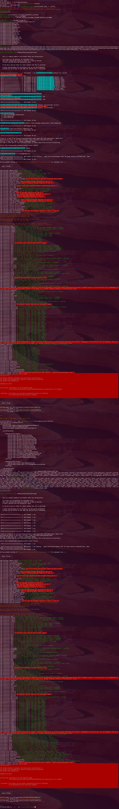

# Example configurations

This directory contains some sample configurations that may be helpful to get a
grip with the configuration file format `Environaut` uses. The examples can be
used by running:

    ./environaut.phar check -c minimal.example.json

The extensive example `environaut.xml` in the root directory XIncludes checks
from the file `docs/examples/pool_of_checks.xml`. The following image shows an
example run with a subsequent run based on the cached settings from the first
run. The JSON settings are not pretty printed as the system's PHP version is
less than v5.4:

